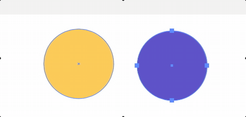
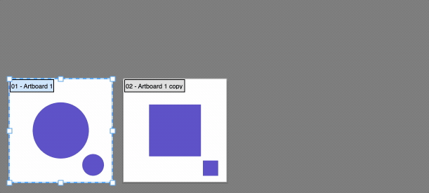
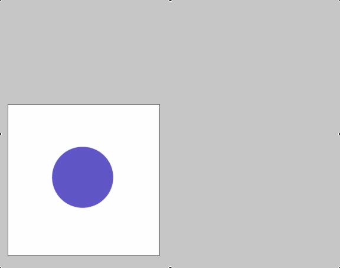

  

This is a collection of some little scripts or drafts has not included in the [catalog].

[catalog]: https://github.com/creold/illustrator-scripts

### How to run scripts

#### Variant 1 — Install 

1. [Download archive] and unzip.
2. Place `<script_name>.jsx` in the Illustrator or Photoshop scripts folder:
	- OS X: `/Applications/Adobe Illustrator (or Photoshop)/Presets/Scripts`
	- Windows (32 bit): `C:\Program Files (x86)\Adobe\Adobe Illustrator (or Photoshop)\Presets\Scripts\`
	- Windows (64 bit): `C:\Program Files\Adobe\Adobe Illustrator  (or Photoshop) (64 Bit)\Presets\Scripts\`
3. Restart program

[Download archive]: https://github.com/creold/adobe-scripts/archive/master.zip 

#### Variant 2 — Drag & Drop
Drag and drop the script file (JS or JSX) into Illustrator Window, Photoshop icon on dock (Mac), taskbar (Win).

#### Variant 3 — Use extension
I recommend the [Scripshon Trees] panel. In it you can specify which folder your script files are stored in.

[Scripshon Trees]: https://exchange.adobe.com/creativecloud.details.15873.scripshon-trees.html

### Donate (optional)
If you find this script helpful, you can buy me a coffee ☕️ via [PayPal] or [Yandex Money] 🙂  

[PayPal]: https://paypal.me/osokin/2usd
[Yandex Money]: https://money.yandex.ru/to/410011149615582
  

## Adobe Illustrator Scripts

### GrayscaleToOpacity.jsx
Convert selection colors to Grayscale and set identical Opacity value.

 

### NumeratesPoints.jsx
Numerates selected points and marks them with colored circles.

 

### ObjectsCounter.jsx
Counts the number of selected objects.

  

### OpacityMaskClip.jsx
The script activates `Clip` checkbox in `Transparency > Opacity Mask`.

  

### RenameArtboardAsLayer.jsx
The script renames each Artboard by the custom name of Layer with the first visible unlocked item on it.

### RenameArtboardAsSize.jsx
The script names the artboard by its size in pixels. If you don't want save Artboard name, but replace with his size, change `var SAVE_NAME = true;` in the script file to `false`   

### RoundCoordinates.jsx
The script rounds the coordinates of the center of the object. Works with document units.

### RenameArtboardAsTopObj.jsx
The script renames each Artboard by the custom name of the first visible unlocked item on it.

### ReverseGradientColor.jsx
Reverse of gradient colors and their opacity. Does not reverse the location of color stops. If the gradient is copied with a Eyedropper Tool (I), the Illustrator thinks it is a single gradient. Use the Reverse Gradient button in the Gradient panel

### SaveAllDocs.jsx
Save all opened docs in one click.

## Adobe Photoshop Scripts

### ClearLayer.jsx
Simple script to clear layers content.

 

 

### GeneratePreview.jsx
Generate JPG preview image from active document. Supports multiple saving with auto-numbering. If you want to change JPG size, edit number in script file `var jpegSizeMax = 1200;` .

 

 

### SaveAll.jsx
Save all opened docs in one click.

 

#### Don't forget sharing link with a friend 🙂 

## Contribute

Found a bug? Please [submit a new issues](https://github.com/creold/adobe-scripts/issues) on GitHub.

### Contact
Email <hi@sergosokin.ru>  

### License

All scripts is licensed under the MIT licence.  
See the included LICENSE file for more details.